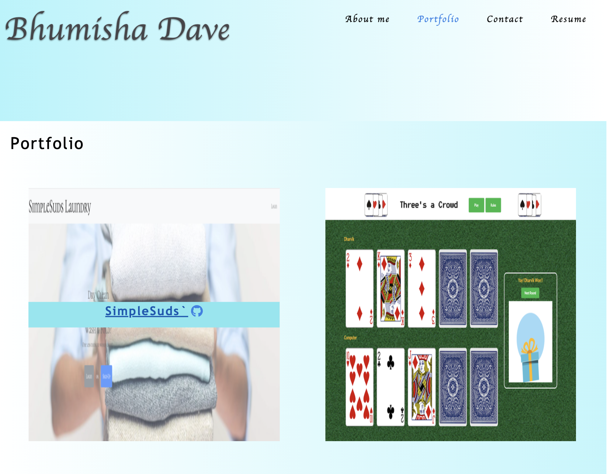
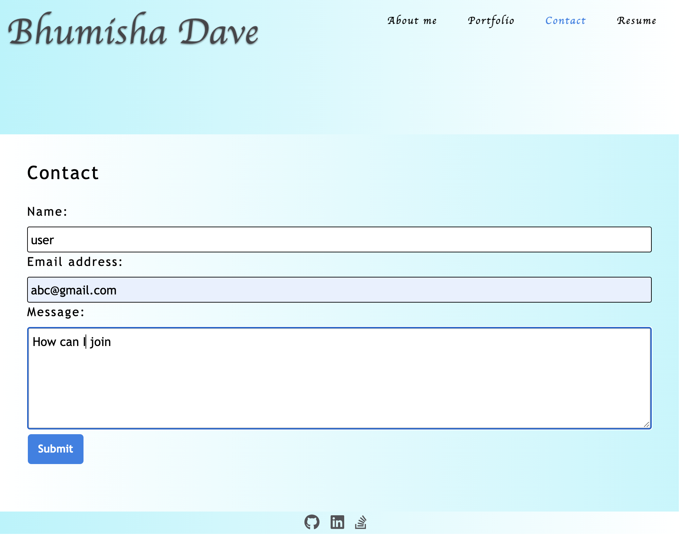
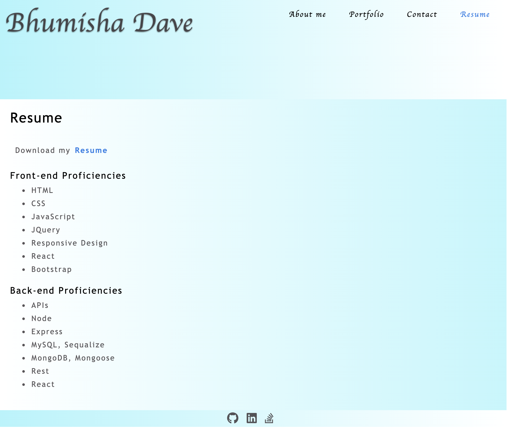

# React Portfolio

    React Portfolio, Name itself suggest it is user portfolio created in React Js , HTML and JSX. 
    This project has used React hooks like useState and useEffect. User can view About Me, Projects worked on and Resume of the me.
    User can also contact to me.

### Technology 
    - React JS
    - Node.JS
    - HTML / JSX
    
    It is simgle page application.

### Installation

To install dependencies, run the following command: 

```npm install```

This will install React and other required libraries which are used in project.

### Project Deployment / GitHub Details

To clone the project:
- SSH - git@github.com:bhumisha/React-Portfolio.git
- HTTPS - https://github.com/bhumisha/React-Portfolio.git
 
Project Source code : https://github.com/bhumisha/React-Portfolio

This application is deployed on Github pages. PFB link
https://bhumisha.github.io/React-Portfolio/

### Images
About Me


Porfolio -> On Mouse hover, User can see details.


Contact 


Resume


### Questions
If you have any additional questions about the repo, open an issue or contact me directly at bhumishadave@gmail.com. 
You can fine more of my work at bhumisha
